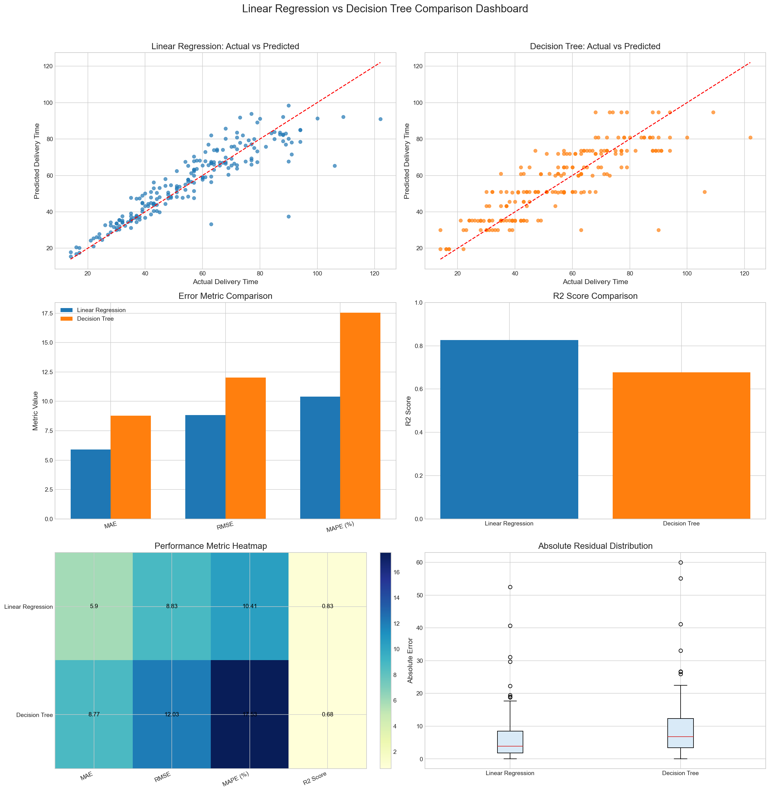

# Delivery Time Estimation using Comparative Regression Analysis

A machine learning project that estimates food delivery time using operational and environmental factors. The project compares **Linear Regression** and **Decision Tree Regression** models and performs extensive evaluation to identify the most reliable predictor.

---

## Overview

Accurate delivery time estimation is essential for improving customer experience and operational efficiency in modern food delivery systems.

This project predicts delivery duration using features such as:

* Distance travelled
* Weather conditions
* Traffic level
* Time of day
* Vehicle type
* Food preparation time
* Courier experience

Instead of focusing solely on prediction, the project emphasizes **model comparison, interpretability, and responsible feature engineering**.

---

## Key Features

* Data preprocessing and cleaning
* Exploratory Data Analysis (EDA)
* Feature engineering and identifier removal
* Linear Regression and Decision Tree comparison
* Cross-validation for stability analysis
* Explainability and feature influence analysis
* Single-entry prediction pipeline

---

## Tech Stack

* Python * Pandas * NumPy * Matplotlib * Scikit-Learn * Google Colab 

---

## Workflow

Dataset → Preprocessing → EDA → Model Training → Evaluation → Cross Validation(model comparison) → Explainability → Prediction

---

## Dataset Features

| Feature                |
| ---------------------- |
| Distance_km            |
| Weather                |
| Traffic_Level          |
| Time_of_Day            |
| Vehicle_Type           |
| Preparation_Time_min   |
| Courier_Experience_yrs |

**Target Variable:** `Delivery_Time_min`

---

## Data Preprocessing

The pipeline includes:

* Missing value handling
* Median and mode imputation
* One-hot encoding
* Removal of identifier columns (`Order_ID`)
* Feature selection
* Train-test splitting

---

## Models Evaluated

### Linear Regression

* Simple and interpretable baseline model.

### Decision Tree Regressor

* Rule-based nonlinear model used for comparison.

---

## Performance Comparison

| Model             |   MAE |   RMSE |    MAPE | R² Score |
| ----------------- | ----: | -----: | ------: | -------: |
| Linear Regression | 5.899 |  8.826 | 10.407% |    0.826 |
| Decision Tree     | 8.774 | 12.032 | 17.532% |    0.677 |

**Linear Regression outperformed Decision Tree across all evaluation metrics and was selected as the final model.**

---

## Cross Validation Results

| Model             | Mean CV MAE |
| ----------------- | ----------: |
| Linear Regression |       6.548 |
| Decision Tree     |       9.223 |

The results indicate that Linear Regression provides better generalization and stability.

---

## Key Insights

The strongest drivers affecting delivery time were:

* Distance travelled
* Traffic level
* Weather conditions
* Preparation time

These insights can support better delivery planning and customer ETA estimation.

---

## Comparison Dashboard


---

## Feature Influence Analysis


---

## Actual vs Predicted Results



---

## Project Structure

```text
├── notebook.ipynb
├── dataset.csv
├── requirements.txt
├── README.md
├── images/
├── model.pkl
└── model_info.json
```

---

## Future Improvements

* Random Forest and Gradient Boosting models
* Web application for real-time prediction
* Route optimization features
* Integration with live delivery datasets


Netaji Subhas University of Technology (NSUT)

